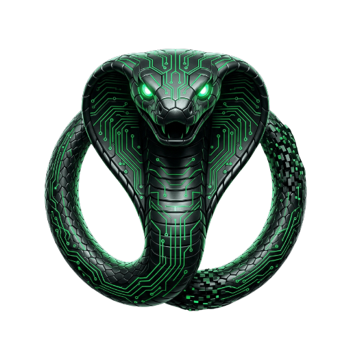

# Glitch Executor Labs Brand Assets

Shared visual identity system for **Glitch Executor Labs** and the three product domains: **Trade**, **Edge**, and **Grow**.

> **Glitch Executor Labs** is one builder shipping AI products across three domains: **Trade** (trading), **Edge** (betting), and **Grow** (digital marketing).

## Mascot — The Cyber Cobra

A coiled ouroboros cobra with neon-green circuit-board tracery and glowing eyes. Black scales, electric green accents.

**Why a cobra?** The Glitch trading bot family is literally a snake lineage:
Viper · Cobra · Indian King Cobra · Taipan · Mamba · Anaconda · Hydra · Terciopelo.
The flagship strategy is `glitch-trade-ouroboros-snake-strategy`. The mascot didn't pick the brand — the brand picked the mascot.



## Asset variants

| Asset | Size | Purpose |
|-------|------|---------|
| `mascot/raw/cobra-mascot.png` | 1200×1200 | Source PNG |
| `mascot/web/mascot-{64,128,256,512,1024}.png` | square | Nav logos, hero, social |
| `favicon/favicon.ico` | 16/32/48 multi-res | Browser tab |
| `favicon/favicon-{16,32,48}.png` | per-size | Modern browser tabs |
| `favicon/apple-touch-icon.png` | 180×180 | iOS home screen |
| `favicon/icon-{192,512}.png` | PWA | Android / installable |
| `og/og-image.png` | 1200×630 | Social card (Twitter, FB, LinkedIn) |

## Color palette

```
#0a0a0f  base       — page background
#12121a  surface    — cards, panels
#1e1e2e  border     — dividers
#00ff88  neon       — primary accent (Trade, master CTAs)
#0088ff  electric   — secondary accent (Edge)
#7c3aed  accent     — tertiary accent (Grow)
#ff8800  warm       — quaternary accent (utility)
```

## Typography

- **Headings & body:** Inter (300, 400, 500, 600, 700, 800, 900)
- **Code & monospace:** JetBrains Mono (400, 500, 700)
- Loaded via Google Fonts CDN.

## Brand lockup rules

**Master brand:**
```
[cobra] Glitch [gradient: neon→electric→accent]Executor[/gradient]
```

**Sub-brands:**
```
[cobra] Glitch [neon]Trade[/neon]      ← trade.glitchexecutor.com
[cobra] Glitch [electric]Edge[/electric]  ← edge.glitchexecutor.com
[cobra] Glitch [accent]Grow[/accent]      ← grow.glitchexecutor.com
```

**The mascot is canonical.** Never tint, recolor, distort, rotate, or modify it. Use as-is from the `mascot/web/` directory.

The wordmark word ("Trade", "Edge", "Grow") gets the sub-brand color tint. "Glitch" stays white. "Executor" gets the gradient on master-brand contexts.

## Don't

- Don't put the mascot on a light background — it's designed for dark themes
- Don't add drop shadows or glows — the circuit tracery already glows
- Don't separate the cobra from its ouroboros coil — that's the silhouette
- Don't use the gradient G placeholder anywhere — it's deprecated

## Usage

### From CDN (preferred for sites)

```html
<link rel="icon" href="https://raw.githubusercontent.com/glitch-exec-labs/glitch-executor-labs-brand-assets/main/favicon/favicon.ico">
<link rel="icon" type="image/png" sizes="32x32" href="https://raw.githubusercontent.com/glitch-exec-labs/glitch-executor-labs-brand-assets/main/favicon/favicon-32.png">
<link rel="apple-touch-icon" href="https://raw.githubusercontent.com/glitch-exec-labs/glitch-executor-labs-brand-assets/main/favicon/apple-touch-icon.png">
<meta property="og:image" content="https://raw.githubusercontent.com/glitch-exec-labs/glitch-executor-labs-brand-assets/main/og/og-image.png">
```

### Local copy

For production sites we serve copies locally to avoid GitHub raw rate limits. Each site repo has a `/assets/brand/` directory mirroring the relevant subset.

## Regenerating assets

If the source PNG changes, run:
```bash
python3 generate.py
```

All web variants are derived from `mascot/raw/cobra-mascot.png` — never edit the variants directly.

---

Maintained by [Glitch Executor](https://glitchexecutor.com).
